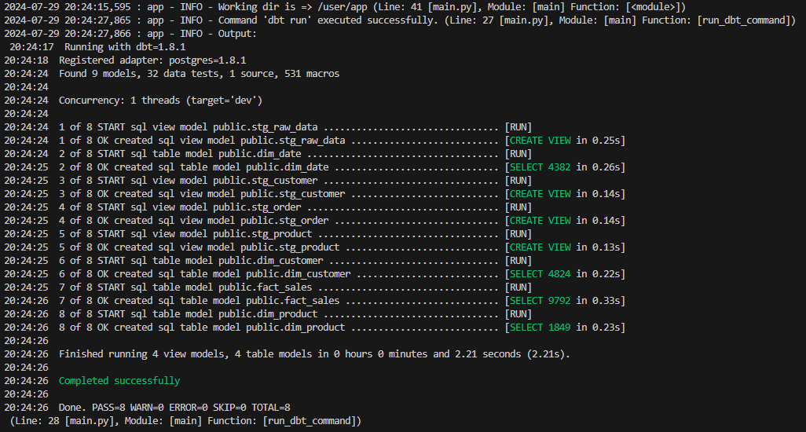
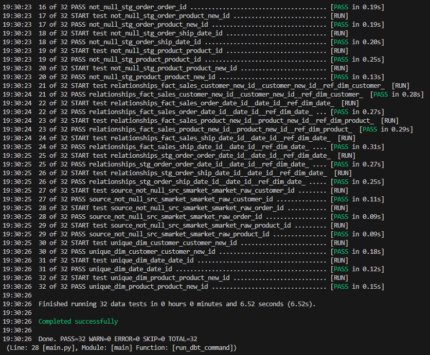

# demo-API-docker-PG-dbt

This project demonstrates the use of Docker to run a Python script that interacts with Kaggle datasets and a PostgreSQL database, and executes dbt commands.

## Table of Contents

- [Scope](#usage)
- [Prerequisites](#prerequisites)
- [Installation](#installation)
- [Usage](#usage)
- [Running the Docker Container](#running-the-docker-container)
- [Executing Commands Inside the Container](#executing-commands-inside-the-container)
- [Project Structure](#project-structure)
- [License](#license)

## Scope

This demo project is to show:
 - API usage and data fetch using Python.
 - Data upload to database using Python.
 - Usage of Docker containers.
 - Usage of dbt on container.
 - Execution of dbt commands using:
    - docker exec
    - Python code
    - command line execution in container for dbt commands

## Prerequisites

- Docker installed on your machine  
    https://www.docker.com/products/docker-desktop/
- VS Code open-source code editor can be used to run commands.  
    https://code.visualstudio.com/download
- DBeaver installed to check Database.  
    https://dbeaver.com/download/
- Kaggle API credentials (saved as `kaggle.json`) and placed into 'config/.kaggle" folder.
- PostgreSQL database and other credentials set in .env file.
    - IMPORTANT: for this demo project ".env" file provided with fake credentials and real credentials never should be provided for public.

## Installation

1. Clone the repository:

    ```bash
    git clone https://github.com/LinasTamk/demo-API-docker-PG-dbt.git
    cd demo-API-docker-PG-dbt
    ```

2. Build the Docker image:

    ```bash
    docker-compose up --build
    ```

## Usage

### Running the Docker Container

To run the Docker container and keep it alive, use the following command:

```bash
docker-compose up
```
To stop container
```bash
docker-compose down
```

## Executing Commands Inside the Container

### First time run demo
Executing Commands Inside the Container

```bash
docker exec -it <container_id> python src_py/main.py --dbt_command "dbt run" --load_raw "y"
```
Replace <container_id> with the actual container ID or name.

You can run dbt commands by passing "--dbt_command" argument.
If no arguments are passed, then this sequesnce of dbt commands will be executed:
 - "dbt deps"
 - "dbt run"
 - "dbt test"

#### IMPORTANT:
First time run need to be with argument '--load_raw "y"', which indicate that data fetch from Kaggle and upload to DB needed.

### Further dbt runs
```bash
docker exec -it <container_id> python src_py/main.py --dbt_command "dbt deps"
```
```bash
docker exec -it <container_id> python src_py/main.py --dbt_command "dbt run"
```
```bash
docker exec -it <container_id> python src_py/main.py --dbt_command "dbt test"
```
Replace <container_id> with the actual container ID or name.

### Results of successful runs

"dbt deps" and raw data load:

   

"dbt run":

   

"dbt test":

   

"database materialization":

   


### Project Structure

```
demo-API-docker-PG-dbt/
│
├── config/
│   ├── dbt
│   ├── .kaggle
├── dbt/
│   ├── ...
├── src_py/
│   ├── main.py
│   ├── get_kaggle_csv.py
│   ├── load_csv_to_pgdb.py
│   ├── logger_custom.py
│   └── db_functions.py
├── Dockerfile
├── docker-compose.yaml
├── requirements.txt
├── README.md
└── .env
```
 - config/: configuration files.
 - dbt/: dbt project files.
 - src_py/: Directory containing the Python scripts.
 - Dockerfile: Docker configuration file.
 - requirements.txt: Python dependencies.
 - README.md: Project documentation.

 - .env: Environment variables file.

dbt project stages:

   

## License
This project is licensed under the MIT License - see the LICENSE file for details.

```
This README.md file provides an overview of the project, including prerequisites, installation instructions, usage examples, and a description of the project structure. Adjust the content as needed to fit your specific project details.
```